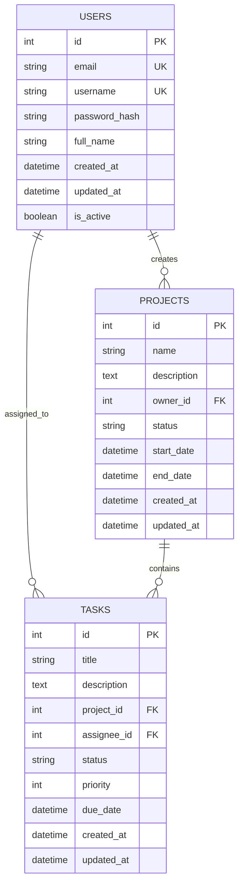

# Project Management Dashboard

A full-stack project management application built with React frontend and Python FastAPI backend, following SOLID principles and design patterns.

## 🏗️ Architecture Overview

### System Architecture
```
┌─────────────────┐    ┌─────────────────┐    ┌─────────────────┐
│   React Frontend│    │  FastAPI Backend│    │  PostgreSQL DB  │
│                 │    │                 │    │                 │
│ - Zustand Store │◄──►│ - REST API      │◄──►│ - Users         │
│ - React Router  │    │ - JWT Auth      │    │ - Projects      │
│ - Axios Client  │    │ - SQLAlchemy    │    │ - Tasks         │
│ - Components    │    │ - Repository    │    │ - Time Logs     │
└─────────────────┘    └─────────────────┘    └─────────────────┘
```

### Design Patterns Applied
- **Repository Pattern**: Data access abstraction
- **Factory Pattern**: Object creation for services
- **Singleton Pattern**: Database connection and configuration
- **Strategy Pattern**: Different authentication methods
- **Observer Pattern**: State management with Zustand

### SOLID Principles Implementation
- **Single Responsibility**: Each class/module has one reason to change
- **Open/Closed**: Extensible through interfaces and inheritance
- **Liskov Substitution**: Polymorphic behavior through abstractions
- **Interface Segregation**: Focused interfaces for specific clients
- **Dependency Inversion**: High-level modules don't depend on low-level modules

## 📊 Database Schema

### Entity Relationship Diagram


## 🚀 API Endpoints

### Authentication
- `POST /api/auth/signup` - User registration
- `POST /api/auth/login` - User login
- `POST /api/auth/refresh` - Refresh JWT token
- `POST /api/auth/logout` - User logout

### Users
- `GET /api/users/me` - Get current user profile
- `PUT /api/users/me` - Update current user profile
- `GET /api/users` - List all users (admin only)

### Projects
- `GET /api/projects` - List user's projects
- `POST /api/projects` - Create new project
- `GET /api/projects/{id}` - Get project details
- `PUT /api/projects/{id}` - Update project
- `DELETE /api/projects/{id}` - Delete project

### Tasks
- `GET /api/projects/{project_id}/tasks` - List project tasks
- `POST /api/projects/{project_id}/tasks` - Create new task
- `GET /api/tasks/{id}` - Get task details
- `PUT /api/tasks/{id}` - Update task
- `DELETE /api/tasks/{id}` - Delete task
- `GET /api/tasks/my-tasks` - Get user's assigned tasks

### Time Logs
- `GET /api/tasks/{task_id}/time-logs` - List task time logs
- `POST /api/tasks/{task_id}/time-logs` - Create time log
- `PUT /api/time-logs/{id}` - Update time log
- `DELETE /api/time-logs/{id}` - Delete time log

## 📁 Project Structure

```
project-management/
├── backend/
│   ├── app/
│   │   ├── __init__.py
│   │   ├── main.py
│   │   ├── config.py
│   │   ├── database.py
│   │   ├── models/
│   │   │   ├── __init__.py
│   │   │   ├── user.py
│   │   │   ├── project.py
│   │   │   ├── task.py
│   │   │   └── time_log.py
│   │   ├── schemas/
│   │   │   ├── __init__.py
│   │   │   ├── user.py
│   │   │   ├── project.py
│   │   │   ├── task.py
│   │   │   └── time_log.py
│   │   ├── repositories/
│   │   │   ├── __init__.py
│   │   │   ├── base.py
│   │   │   ├── user_repository.py
│   │   │   ├── project_repository.py
│   │   │   ├── task_repository.py
│   │   │   └── time_log_repository.py
│   │   ├── services/
│   │   │   ├── __init__.py
│   │   │   ├── auth_service.py
│   │   │   ├── user_service.py
│   │   │   ├── project_service.py
│   │   │   ├── task_service.py
│   │   │   └── time_log_service.py
│   │   ├── api/
│   │   │   ├── __init__.py
│   │   │   ├── deps.py
│   │   │   ├── auth.py
│   │   │   ├── users.py
│   │   │   ├── projects.py
│   │   │   ├── tasks.py
│   │   │   └── time_logs.py
│   │   └── utils/
│   │       ├── __init__.py
│   │       ├── security.py
│   │       └── validators.py
│   ├── tests/
│   │   ├── __init__.py
│   │   ├── conftest.py
│   │   ├── test_auth.py
│   │   ├── test_users.py
│   │   ├── test_projects.py
│   │   ├── test_tasks.py
│   │   └── test_time_logs.py
│   ├── alembic/
│   │   ├── versions/
│   │   ├── env.py
│   │   └── alembic.ini
│   ├── requirements.txt
│   ├── .env.example
│   └── Dockerfile
├── frontend/
│   ├── src/
│   │   ├── components/
│   │   │   ├── common/
│   │   │   │   ├── Button.tsx
│   │   │   │   ├── Input.tsx
│   │   │   │   ├── Modal.tsx
│   │   │   │   └── Loading.tsx
│   │   │   ├── layout/
│   │   │   │   ├── Navbar.tsx
│   │   │   │   ├── Sidebar.tsx
│   │   │   │   └── Layout.tsx
│   │   │   ├── auth/
│   │   │   │   ├── LoginForm.tsx
│   │   │   │   └── SignupForm.tsx
│   │   │   ├── forms/
│   │   │   │   ├── ProjectForm.tsx
│   │   │   │   └── TaskForm.tsx
│   │   │   └── projects/
│   │   │       ├── ProjectList.tsx
│   │   │       ├── ProjectCard.tsx
│   │   │       └── ProjectForm.tsx
│   │   ├── pages/
│   │   │   ├── Login.tsx
│   │   │   ├── Signup.tsx
│   │   │   ├── Dashboard.tsx
│   │   │   ├── Projects.tsx
│   │   │   ├── ProjectDetail.tsx
│   │   │   └── Tasks.tsx
│   │   ├── stores/
│   │   │   ├── authStore.ts
│   │   │   ├── projectStore.ts
│   │   │   └── taskStore.ts
│   │   ├── services/
│   │   │   ├── api.ts
│   │   │   ├── authService.ts
│   │   │   ├── projectService.ts
│   │   │   └── taskService.ts
│   │   ├── utils/
│   │   │   ├── constants.ts
│   │   │   └── helpers.ts
│   │   ├── types/
│   │   │   └── index.ts
│   │   ├── App.tsx
│   │   ├── main.tsx
│   │   └── index.css
│   ├── public/
│   ├── package.json
│   ├── vite.config.ts
│   ├── tsconfig.json
│   └── Dockerfile
├── docker-compose.yml
├── .gitignore
├── .editorconfig
└── README.md
```

## 🗓️ Development Plan

### ✅ Phase 1: Foundation (Completed)
- [x] Project setup and architecture design
- [x] Database schema and API planning
- [x] Backend scaffolding with FastAPI
- [x] Frontend scaffolding with React + Vite
- [x] Basic models and authentication

### ✅ Phase 2: Core Features (Completed)
- [x] Complete CRUD operations for all entities
- [x] Advanced filtering and pagination
- [x] Time tracking functionality
- [x] User management and permissions

### ✅ Phase 3: Frontend Development (Completed)
- [x] Complete UI components and forms
- [x] State management implementation
- [x] API integration with services
- [x] Responsive design and modern UI
- [x] Authentication flows (Login/Signup)
- [x] Project management interface
- [x] Task management interface
- [x] Dashboard with statistics
- [x] Project detail pages with tabs
- [x] Form validation and error handling

### 🔄 Phase 4: Testing & Polish (In Progress)
- [ ] Comprehensive testing
- [ ] Performance optimization
- [ ] Documentation
- [ ] Deployment preparation

## 🎯 Phase 3 Features Implemented

### Frontend Components
- **Authentication**: Complete login and signup forms with validation
- **Dashboard**: Statistics cards, recent projects, and tasks overview
- **Projects**: Full CRUD operations with search, filtering, and pagination
- **Tasks**: Complete task management with status, priority, and assignment
- **Project Details**: Tabbed interface with overview, tasks, and time logs
- **Forms**: Reusable form components for projects and tasks
- **Layout**: Responsive navigation and sidebar

### UI/UX Features
- **Modern Design**: Clean, professional interface with Tailwind CSS
- **Responsive Layout**: Works on desktop, tablet, and mobile
- **Loading States**: Skeleton loaders and spinners
- **Error Handling**: User-friendly error messages and validation
- **Modal Dialogs**: Create and edit forms in modal windows
- **Status Badges**: Color-coded status and priority indicators
- **Progress Bars**: Visual progress tracking for projects
- **Search & Filter**: Advanced filtering and search capabilities

### Technical Features
- **TypeScript**: Full type safety throughout the application
- **React Hook Form**: Form validation and state management
- **Zustand**: Lightweight state management
- **Axios**: HTTP client with interceptors
- **React Router**: Client-side routing with protected routes
- **Lucide Icons**: Beautiful, consistent iconography

## 🛠️ Getting Started

### Prerequisites
- Python 3.8+
- Node.js 16+
- PostgreSQL 12+
- Docker (optional)

### Backend Setup
```bash
cd backend
python -m venv venv
source venv/bin/activate  # On Windows: venv\Scripts\activate
pip install -r requirements.txt
cp .env.example .env
# Edit .env with your database credentials
alembic upgrade head
uvicorn app.main:app --reload
```

### Frontend Setup
```bash
cd frontend
npm install
npm run dev
```

### Database Setup
```bash
# Using Docker
docker-compose up -d postgres

# Or install PostgreSQL locally and create database
createdb project_management
```

## 🧪 Testing

### Backend Tests
```bash
cd backend
pytest
```

### Frontend Tests
```bash
cd frontend
npm test
```

## 📚 Documentation

- [API Documentation](./docs/api.md)
- [Database Schema](./docs/database.md)
- [Frontend Architecture](./docs/frontend.md)
- [Deployment Guide](./docs/deployment.md)

## 🤝 Contributing

1. Fork the repository
2. Create a feature branch
3. Make your changes
4. Add tests
5. Submit a pull request

## 📄 License

MIT License - see LICENSE file for details 