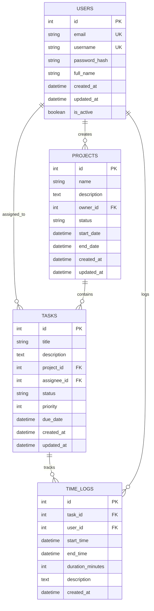

# Project Management Dashboard - Architecture Documentation

## 🏗️ System Architecture Overview

The Project Management Dashboard is built using a modern, scalable architecture that follows SOLID principles and implements several design patterns for maintainability and extensibility.

### High-Level Architecture

```
┌─────────────────────────────────────────────────────────────────┐
│                        Frontend Layer                           │
│  ┌─────────────┐  ┌─────────────┐  ┌─────────────┐            │
│  │   React     │  │   Zustand   │  │   Axios     │            │
│  │ Components  │  │   Store     │  │   Client    │            │
│  └─────────────┘  └─────────────┘  └─────────────┘            │
└─────────────────────────────────────────────────────────────────┘
                                │
                                ▼
┌─────────────────────────────────────────────────────────────────┐
│                        API Gateway                              │
│  ┌─────────────┐  ┌─────────────┐  ┌─────────────┐            │
│  │   FastAPI   │  │   CORS      │  │   JWT Auth  │            │
│  │   Router    │  │ Middleware  │  │   Middleware│            │
│  └─────────────┘  └─────────────┘  └─────────────┘            │
└─────────────────────────────────────────────────────────────────┘
                                │
                                ▼
┌─────────────────────────────────────────────────────────────────┐
│                      Service Layer                              │
│  ┌─────────────┐  ┌─────────────┐  ┌─────────────┐            │
│  │   Auth      │  │   Project   │  │   Task      │            │
│  │  Service    │  │  Service    │  │  Service    │            │
│  └─────────────┘  └─────────────┘  └─────────────┘            │
└─────────────────────────────────────────────────────────────────┘
                                │
                                ▼
┌─────────────────────────────────────────────────────────────────┐
│                    Repository Layer                             │
│  ┌─────────────┐  ┌─────────────┐  ┌─────────────┐            │
│  │   User      │  │   Project   │  │   Task      │            │
│  │Repository   │  │ Repository  │  │ Repository  │            │
│  └─────────────┘  └─────────────┘  └─────────────┘            │
└─────────────────────────────────────────────────────────────────┘
                                │
                                ▼
┌─────────────────────────────────────────────────────────────────┐
│                      Data Layer                                 │
│  ┌─────────────┐  ┌─────────────┐  ┌─────────────┐            │
│  │ PostgreSQL  │  │   Redis     │  │   SQLAlchemy│            │
│  │   Database  │  │   Cache     │  │     ORM     │            │
│  └─────────────┘  └─────────────┘  └─────────────┘            │
└─────────────────────────────────────────────────────────────────┘
```

## 🎯 Design Patterns Implementation

### 1. Repository Pattern
**Purpose**: Abstract data access layer from business logic
**Implementation**: Each entity has its own repository class

```python
# Example: UserRepository
class UserRepository(BaseRepository[User]):
    def get_by_email(self, email: str) -> Optional[User]:
        return self.db.query(User).filter(User.email == email).first()
    
    def get_active_users(self) -> List[User]:
        return self.db.query(User).filter(User.is_active == True).all()
```

**Benefits**:
- Decouples business logic from data access
- Easier to test with mock repositories
- Centralized data access logic

### 2. Factory Pattern
**Purpose**: Create objects without specifying their exact classes
**Implementation**: Service factory for creating different service instances

```python
class ServiceFactory:
    @staticmethod
    def create_user_service(db: Session) -> UserService:
        return UserService(UserRepository(db))
    
    @staticmethod
    def create_project_service(db: Session) -> ProjectService:
        return ProjectService(ProjectRepository(db))
```

**Benefits**:
- Encapsulates object creation logic
- Easy to extend with new service types
- Consistent service creation across the application

### 3. Singleton Pattern
**Purpose**: Ensure only one instance of a class exists
**Implementation**: Database manager and configuration settings

```python
class DatabaseManager:
    _instance = None
    
    def __new__(cls):
        if cls._instance is None:
            cls._instance = super().__new__(cls)
        return cls._instance
```

**Benefits**:
- Prevents multiple database connections
- Centralized resource management
- Memory efficiency

### 4. Strategy Pattern
**Purpose**: Define a family of algorithms and make them interchangeable
**Implementation**: Different authentication strategies

```python
class AuthenticationStrategy(ABC):
    @abstractmethod
    def authenticate(self, credentials: dict) -> Optional[User]:
        pass

class JWTStrategy(AuthenticationStrategy):
    def authenticate(self, credentials: dict) -> Optional[User]:
        # JWT authentication logic
        pass

class OAuthStrategy(AuthenticationStrategy):
    def authenticate(self, credentials: dict) -> Optional[User]:
        # OAuth authentication logic
        pass
```

### 5. Observer Pattern
**Purpose**: Define a one-to-many dependency between objects
**Implementation**: State management with Zustand

```typescript
// Frontend state management
export const useAuthStore = create<AuthStore>()(
  persist(
    (set, get) => ({
      user: null,
      isAuthenticated: false,
      login: (tokenData) => set({ user: tokenData.user, isAuthenticated: true }),
      logout: () => set({ user: null, isAuthenticated: false }),
    }),
    { name: 'auth-storage' }
  )
)
```

## 🔧 SOLID Principles Implementation

### 1. Single Responsibility Principle (SRP)
Each class has one reason to change:

- **UserService**: Handles user-related business logic
- **ProjectRepository**: Manages project data access
- **AuthMiddleware**: Handles authentication only

### 2. Open/Closed Principle (OCP)
Open for extension, closed for modification:

```python
class BaseRepository(Generic[T]):
    def get(self, id: int) -> Optional[T]:
        # Base implementation
    
    def create(self, obj: T) -> T:
        # Base implementation

class UserRepository(BaseRepository[User]):
    def get_by_email(self, email: str) -> Optional[User]:
        # Extension without modifying base class
        pass
```

### 3. Liskov Substitution Principle (LSP)
Subtypes are substitutable for their base types:

```python
class BaseService(ABC):
    @abstractmethod
    def create(self, data: dict) -> Any:
        pass

class UserService(BaseService):
    def create(self, data: dict) -> User:
        # Can be used anywhere BaseService is expected
        pass
```

### 4. Interface Segregation Principle (ISP)
Clients shouldn't depend on interfaces they don't use:

```python
class ReadOnlyRepository(ABC):
    @abstractmethod
    def get(self, id: int) -> Optional[T]:
        pass

class WritableRepository(ReadOnlyRepository):
    @abstractmethod
    def create(self, obj: T) -> T:
        pass
    
    @abstractmethod
    def update(self, obj: T) -> T:
        pass
```

### 5. Dependency Inversion Principle (DIP)
High-level modules don't depend on low-level modules:

```python
class UserService:
    def __init__(self, repository: UserRepository):
        self.repository = repository  # Depends on abstraction
    
    def create_user(self, user_data: dict) -> User:
        return self.repository.create(User(**user_data))
```

## 📊 Database Design

### Entity Relationship Diagram


### Database Constraints
- **Foreign Key Constraints**: Ensure referential integrity
- **Unique Constraints**: Email and username uniqueness
- **Check Constraints**: Valid status values
- **Indexes**: Performance optimization on frequently queried fields

## 🔐 Security Architecture

### Authentication Flow
1. **Login**: User provides credentials
2. **Validation**: Server validates credentials
3. **Token Generation**: JWT token created with user info
4. **Token Storage**: Token stored in secure HTTP-only cookie
5. **Request Authentication**: Token validated on each request

### Authorization
- **Role-based Access Control (RBAC)**: Different permission levels
- **Resource-level Permissions**: Users can only access their own resources
- **API Rate Limiting**: Prevent abuse and ensure performance

### Data Protection
- **Password Hashing**: bcrypt with salt
- **HTTPS**: All communications encrypted
- **Input Validation**: Prevent injection attacks
- **SQL Injection Prevention**: Parameterized queries

## 🚀 Performance Considerations

### Backend Optimization
- **Database Indexing**: Optimized queries
- **Connection Pooling**: Efficient database connections
- **Caching**: Redis for frequently accessed data
- **Pagination**: Large dataset handling

### Frontend Optimization
- **Code Splitting**: Lazy loading of components
- **Bundle Optimization**: Tree shaking and minification
- **Caching**: React Query for API response caching
- **Virtual Scrolling**: Large list rendering

## 🔄 Deployment Architecture

### Development Environment
```
┌─────────────┐    ┌─────────────┐    ┌─────────────┐
│   Frontend  │    │   Backend   │    │  PostgreSQL │
│   (Vite)    │◄──►│  (FastAPI)  │◄──►│   Database  │
│   Port 3000 │    │  Port 8000  │    │   Port 5432 │
└─────────────┘    └─────────────┘    └─────────────┘
```

### Production Environment
```
┌─────────────┐    ┌─────────────┐    ┌─────────────┐
│   Nginx     │    │   Backend   │    │  PostgreSQL │
│   Reverse   │◄──►│  (FastAPI)  │◄──►│   Database  │
│   Proxy     │    │   Cluster   │    │   Cluster   │
└─────────────┘    └─────────────┘    └─────────────┘
```

## 📈 Scalability Considerations

### Horizontal Scaling
- **Load Balancing**: Distribute traffic across multiple instances
- **Database Sharding**: Partition data across multiple databases
- **Microservices**: Break down into smaller, focused services

### Vertical Scaling
- **Resource Optimization**: Efficient memory and CPU usage
- **Database Optimization**: Query optimization and indexing
- **Caching Strategy**: Multi-level caching (application, database, CDN)

## 🧪 Testing Strategy

### Backend Testing
- **Unit Tests**: Individual component testing
- **Integration Tests**: API endpoint testing
- **Database Tests**: Data access layer testing
- **Security Tests**: Authentication and authorization testing

### Frontend Testing
- **Component Tests**: React component testing
- **Integration Tests**: User interaction testing
- **E2E Tests**: Full application flow testing
- **Performance Tests**: Load and stress testing

## 📚 API Documentation

### RESTful Design
- **Resource-based URLs**: `/api/v1/projects/{id}`
- **HTTP Methods**: GET, POST, PUT, DELETE
- **Status Codes**: Proper HTTP status codes
- **Error Handling**: Consistent error responses

### OpenAPI/Swagger
- **Auto-generated Documentation**: From FastAPI
- **Interactive Testing**: Try endpoints directly
- **Schema Validation**: Request/response validation

This architecture provides a solid foundation for a scalable, maintainable, and secure project management application. 